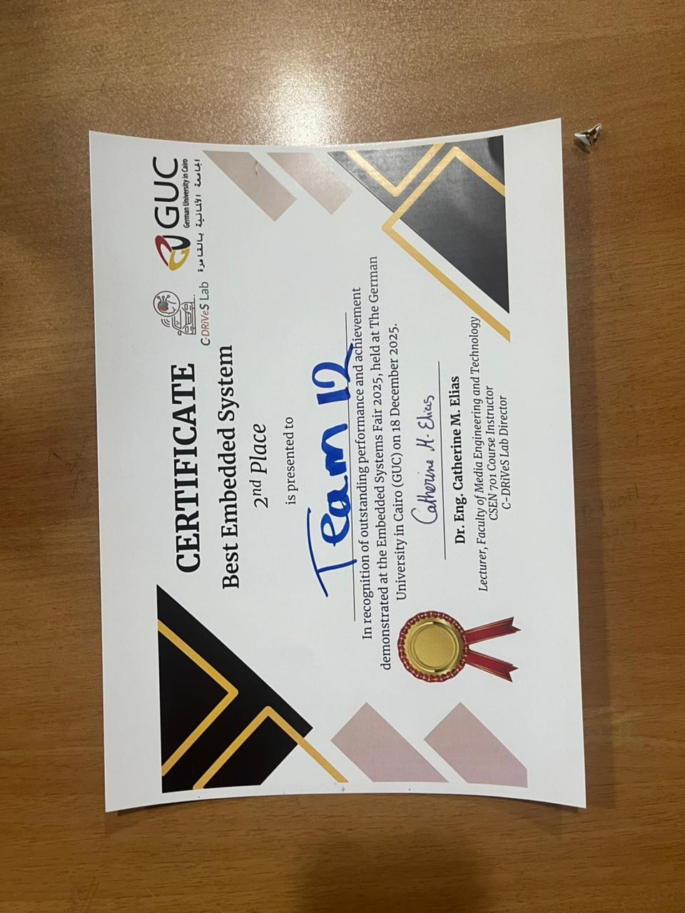

# 🪞 Pico AI Smart Mirror - Station 6: Mimic's Reflection
**An AI-Powered Interactive Treasure Hunt Puzzle**

[](./certificate.jpg)
[](https://www.c-language.org/)
[](https://www.python.org/)
[](https://www.raspberrypi.com/products/raspberry-pi-pico/)

> **🥈 2nd Place Winner - Best Embedded Project | Winter 2025 | German University in Cairo (GUC)**

**Mimic's Reflection** is a hybrid embedded systems and computer vision project. Built around the Raspberry Pi Pico (RP2040), it challenges users to unlock a physical "Smart Mirror" mechanism by performing a specific sequence of facial gestures. The project bridges low-level hardware orchestration (state-machine-driven C firmware) with high-level artificial intelligence (a parallel Python computer vision model).

---

## 📖 The Lore: Guardians of the Ancient Treasure Hunt
*Agents must translate the final number of a geometric sequence into a specific, sustained sequence of facial gestures.* The user calculates a 3-digit numerical clue (e.g., `162`) and enters it on the station's keypad. The Smart Mirror awakens, displaying three sequential target gestures. The Agents must perform each gesture—verified in real-time by the "Eye of Chronos" (our AI camera module). Success rotates the mirror $180^{\circ}$ to reveal the next hidden clue, accompanied by a victory melody.

---

## ✨ Key Features
* 🧠 **Real-Time Facial Recognition:** A Python-based computer vision model processes camera feeds to classify user facial expressions (Smiling, Blinking, Surprised, etc.) in real time.
* ⚙️ **Robust C-State Machine:** The core logic runs on the RP2040, featuring a highly reliable orthogonal state machine handling concurrent tasks (game logic, timers, and LED feedback).
* 🗣️ **Immersive Audio & TTS:** Features dynamic Text-to-Speech (TTS) prompts and audio cues/songs (e.g., `Surprise.mp3`, `song.mp3`) to guide the user through the experience.
* 🦾 **Electromechanical Actuation:** Uses an H-Bridge driven DC motor to physically rotate the mirror upon puzzle completion.
* 📟 **Smart Peripheral Integration:** Manages a 4x4 matrix keypad, an I2C LCD for text feedback, a Push Button for initiation, and an RGB LED for visual status tracking.

---

## 🛠️ Hardware Architecture

The system utilizes the following physical components:
* **Microcontroller:** Raspberry Pi Pico (RP2040)
* **Inputs:** 
  * 4x4 Matrix Keypad (For sequence entry)
  * Push Button (Active-low Start Button)
  * Camera Module (Connected to host PC for AI processing)
* **Outputs:** 
  * I2C LCD Display (The "Smart Mirror" text interface)
  * Common-Cathode RGB LED (System state indicator)
  * DC Motor with L298N H-Bridge (Reward actuator)

---

## 📂 Repository Structure

Because this is a hybrid system, the repository is split into two main environments: the low-level C firmware and the high-level Python AI scripts.

```text
├── blink/                         # ⚙️ Embedded C Firmware (RP2040)
│   ├── CMakeLists.txt             # Build configurations
│   ├── main.c                     # Core State Machine Logic
│   ├── keypad.c / .h              # 4x4 Keypad Matrix Driver
│   ├── lcd_i2c.c / .h             # I2C Display Driver
│   ├── rgb_led.c / .h             # Hardware PWM LED Driver
│   ├── motor_control.c / .h       # DC Motor H-Bridge Driver
│   ├── button.c / .h              # Push Button Driver
│   └── tts_listener.py            # Local TTS Python listener scripts
│
└── embedded_systems_CV_project-main/  # 🧠 Python AI & Computer Vision
    ├── Station6_AI/
    │   ├── src/main.py            # AI Gesture Recognition Loop
    │   ├── serial_sender.py       # PC-to-Pico Serial Communication
    │   ├── requirements.txt       # Python dependencies 
    │   ├── face_landmarker.task   # ML Model weights
    │   └── *.mp3                  # Audio and Song files
```

---

## 🎮 System Operational Flow (The State Machine)
The RP2040 runs a deterministic state machine to ensure flawless user interaction:

1. **IDLE / CODE_ENTER:** The system waits for keypad input. The LCD updates the current typed digits.

2. **VALIDATION:** If the sequence matches the target (e.g., 162), the RGB LED turns Blue. The LCD prompts the user to press START.

3. **GESTURE RECOGNITION (STAGES 1-3):** 
   * The system enters an active scan state (LED turns Red).
   * The Python AI begins verifying the face against the mapped digits (e.g., 1 = Smile, 6 = Surprise, 2 = Right Eye Blink).
   * The user must hold the correct gesture for a continuous 10-second countdown.
   * **Failure Path:** If the timer expires before the gesture is held, the system flashes red and resets.

4. **REWARD (GREEN STATE):** Upon three consecutive successes, the LED turns Green. The DC motor activates to rotate the mirror, and the final victory audio plays.

---

## 🚀 Installation & Setup

### 1. Flashing the Pico (C Firmware)
1. Install the [Raspberry Pi Pico C/C++ SDK](https://github.com/raspberrypi/pico-sdk).
2. Navigate to the `blink/` directory.
3. Build the project using CMake:
   ```bash
   mkdir build && cd build
   cmake ..
   make
   ```
4. Drag and drop the compiled `.uf2` file onto your Pico while in BOOTSEL mode.

### 2. Setting up the AI (Python Environment)
1. Ensure Python 3.11+ is installed on the host machine.
2. Navigate to the AI directory:
   ```bash
   cd embedded_systems_CV_project-main/Station6_AI/
   ```
3. Install the required computer vision libraries (OpenCV, MediaPipe, PySerial, etc.):
   ```bash
   pip install -r requirements.txt
   ```
4. Run the main AI script and ensure your webcam is connected:
   ```bash
   python src/main.py
   ```

---

## 👥 The Team (Team 12)
This project was successfully designed and implemented by **Team 12** as part of the **CSEN 701 - Embedded System Architecture** course at GUC.

* **Habiba ElHabibi**
* **Rana Ali**
* **Shahd Alaa**
* **Youssef Yasser**
* **Mohamed Sultan**
* **Mahmoud Ashraf**
* **Daniel Ehab**

**Under the Supervision of:** Dr. Eng. Catherine M. Elias

---

## 🏆 Achievements


---

## 📧 Contact
For questions or collaboration opportunities, feel free to reach out to any team member via GitHub.

---

**Made with ❤️ by Team 12 | GUC Winter 2025**
